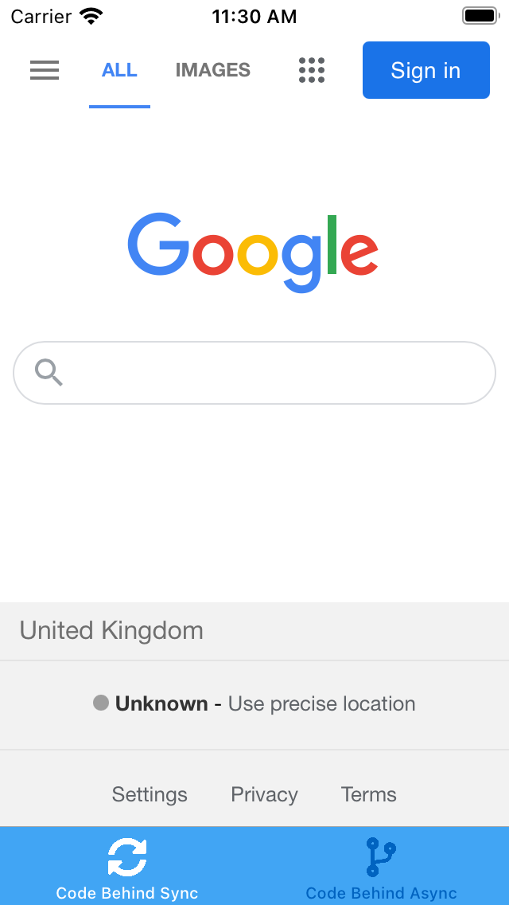
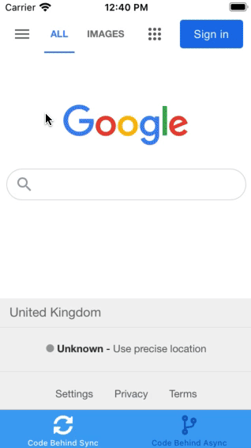
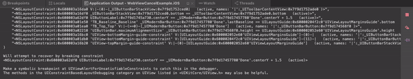
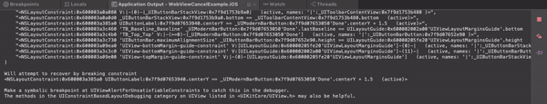

# WebView Navigating Issue
Sample repository for an issue I've come across with the Xamarin.Forms.WebView Navigating method.


## The Issue

The `Xamarin.Forms.WebView` component exposes the following events:

| Event        | Description                                                  |
| ------------ | ------------------------------------------------------------ |
| `Navigating` | Called when the browser is about to navigate. This event can be used for the developer to override the native navigation and block the browser from navigating |
| `Navigated`  | Called once the browser has navigated to and loaded the page requested. |

I would like to use the `Navigating` event to block navigation to certain sites defined by my app. I have found an issue with the behaviour of this control that prevents you from being able to go to another thread and do any meaningful work before blocking the navigation. This is caused by an apparent race condition caused by the nature the `WebViewRenderer` has been implemented.


In this repository I will demonstrate the issue and outline my suggestions to change the `Xamarin.Forms.WebView` component to be better suited to this specific use case (making it alot more powerful).


## Sample Code

Included in this repository is a Forms app that contains my reproduction example of this issue. I have different `ContentPage`'s that each display a `WebView`. In the `Navigating` event I am calling a custom service (`ISiteValidator`) that evaluates whether the user should be allowed to browse to the site. There are 2 types of site validator:

- `ISiteValidator`
- `ISiteValidatorAsync`

The difference (obviously) being that one is synchronous and the other is asynchronous. This is important because the current implementation of the `WebView.Navigating` event does not lend itself to calling a `Task`. In a real world application a developer would want the option of being able to go away adn validate the url being requested before confirming the navigation. In my case I am using a filtering API to determine site categories and preventing navigation to blocked categories.


I have currently provided 2 pages:

- `CodeBehindSyncPage` - Dynamically blocking site synchronously
- `CodeBehindAsyncPage` - Dynamically blocking site asynchronously



Load the app and perform the following tests:

| Step | Action                                                 | Expected Result                                              | Success? |
| ---- | ------------------------------------------------------ | ------------------------------------------------------------ | -------- |
| 1    | Click **Code Behind Sync** tab                         | **Code Behind Sync** `ContentPage` is displayed and loads Google | ✅        |
| 2    | Search for `"facebook"`                                | Google search results are showed for the string `"facebook"` | ✅        |
| 3    | Click any link that leads to the `facebook.com` domain | Navigation is blocked, debug messages are logged to the application output saying `Site {0} is allowed: false` | ✅        |
| 4    | Click **Code Behind Async** tab                        | **Code Behind Asnc** `ContentPage` is displayed and loads Google | ✅        |
| 5    | Search for `"facebook"`                                | Google search results are showed for the string `"facebook"` | ✅        |
| 6    | Click any link that leads to the `facebook.com` domain | Facebook is successfully loaded, debug messages are logged to the application output saying `Site {0} is allowed: false`, After a delay a popup displays explaining navigation should have been blocked. | ❌        |


I believe the issue comes about due to the implementation at the renderer level, for this example I will just demonstrate iOS. In the `WKWebViewRenderer` [`DecidePolicy` method](https://github.com/xamarin/Xamarin.Forms/blob/947e1783950904e658bb016dc54fdcc6d9cecc0a/Xamarin.Forms.Platform.iOS/Renderers/WkWebViewRenderer.cs#L744, from line 777. `WebNavigatingEventArgs` are created and sent to the Forms control (which raises the event). Then the args are used to determine whether the `WKWebView` should allow or cancel the navigation. If the `WebNavigatingArgs` are updated before line 781 executes, the navigation event can be overriden. If the user does any kind of intensive work in  `WebView.Navigating` or goes to another thread this line will execute before the work has completed meaning that the navigating does not get cancelled.


I propose adding an opt in task that can be waited on in this decision handler. If the task is null, the current behaviour is observed. If the task is not null, it is executed and awaited until it has executed. At this point the developer has alot more control over the behaviour of the `WebView` without going to native code.


## Screenshots

Below are some screenshots / gifs of the application and my examples in action.


**Running The App**

This is what running the tests should look like on the app.



**Sync Output**

The expected output for the sync test. Note that the browser never reports navigation to a banned url (facebook / twitter)



**Async Output**

The expected output for the async test. Note the browser reports navigation long before the `ISiteValidatorAsync` ever returns its validation judgement.




## Proposed Changes

Here i am verymuch open for ideas 😊

I've hacked together a working example within `Xamarin.Forms` but it relies on making the view implement some code to choose a method in the viewmodel to execute. Its important to me that this code fits the MVVM paradigm, but I couldn't think of how else to achieve this without turning to what I would consider cheating (MessagingCenter etc).


**Renderer**

In the renderer, add an awaitable call instead of using the `WebNavigatingArgs` to handle the decision:

```csharp
public override async void DecidePolicy(WKWebView webView, WKNavigationAction navigationAction, Action<WKNavigationActionPolicy> decisionHandler)
{
    ...
    _lastEvent = navEvent;
    var request = navigationAction.Request;
    var lastUrl = request.Url.ToString();
    var args = new WebNavigatingEventArgs(navEvent, new UrlWebViewSource { Url = lastUrl }, lastUrl);

    WebView.SendNavigating(args);
    _renderer.UpdateCanGoBackForward();

    var decision = await ExecuteNavigationPolicy(args);

    decisionHandler(decision);
}
```


Call a method that checks whether the Forms control has opted into this functionality:

```csharp
private async Task<WKNavigationActionPolicy> ExecuteNavigationPolicy(WebNavigatingEventArgs args)
{
    if (WebView.SiteRequestOverriden)
        return args.Cancel;

    var result = await WebView.TriggerPolicyRequest(args);

    return ConvertBoolToPolicy(result);
}

private WKNavigationActionPolicy ConvertBoolToPolicy(bool result)
{
    return result switch
    {
        true => WKNavigationActionPolicy.Allow,
        false => WKNavigationActionPolicy.Cancel
    }
}
```


**Forms**

At the Forms level we would need to add a method we can execute on the control, that a `ContentPage` can opt into and pass the method of a view model to execute. I think this is where my spaghetti design comes in, but to my mind it preserves the MVVM paradigm because the ViewModel is not  aware of the views, but is able to execute business logic on behalf of the view (Essentially a command that results something).

```csharp
public event EventHandler<WebNavigatingEventArgs> OnSiteRequest;

		Func<Task<bool>> PolicyEvaluator;

		public async Task<bool> EvaluateSiteRequest(WebNavigatingEventArgs args)
		{
      //Invoke event that the control can use to update the url value on the PolicyEvaluator
			OnSiteRequest?.Invoke(this, args);

			return await CanBrowseToSite();
		}

		public async Task<bool> CanBrowseToSite()
		{
			if (PolicyEvaluator == null)
			{
        //If view hasn't opted in we will auto navigate
				Debug.WriteLine("Evaluator was null, returning true");
				return true;
			}

			return await PolicyEvaluator?.Invoke();
		}

		//View uses this method to set PolicyEvaluator
		public void SetSiteEvaluator(Task<bool> task)
		{
			PolicyEvaluator = () => task;
		}
```


**View / ViewModel**

I created an interface for my ViewModel to implement:

```csharp
public interface INavigationRequestDelegate
{
	Task<bool> CanBrowseToSite(string url);
}
```

The implementation is the business logic, for my app I would be talking to my web filtering system (cache / api) and determining whether the site is approved for navigation. The view can then use this interface to pass the method back to the `WebView` control for execution.

```csharp
public partial class WebViewPage : ContentPage
{
	private INavigationRequestDelegate _navRequestDelegate;

	public WebViewPage()
	{
		InitializeComponent();
		
    //Run when the viewmodel gets set
		this.BindingContextChanged += OnBindingContextChanged;
	}

	private void OnBindingContextChanged(object sender, EventArgs e)
	{
		_navRequestDelegate = this.BindingContext as INavigationRequestDelegate;

		if (_navRequestDelegate == null)
			throw new InvalidCastException("Could not cast to InterceptPageViewModel");


		MyWebView.OnSiteRequest += OnSiteRequest;
	}

	private void OnSiteRequest(object sender, WebNavigatingEventArgs e)
	{
    //Returns the method the control should execute with value prepopulated
		MyWebView.SetSiteEvaluator(_navRequestDelegate.CanBrowseToSite(e.Url));
	}
}
```


If I run this app, the ViewModel code is executed and awaited before the `DecidePolicy` method returns a result. This allows me to block unapproved sites using whatever logic I see fit. The code solution is definitely not very elegent and I would like to hear from the Xamarin Community about how this could become more fit for Forms.


I will also probably be forking `WebView` in the mean time implementing crazy functionality like this, I might even OS it 😉 I just thought this would be a nice addition for other developers that would be alot more useful than what is currently present.